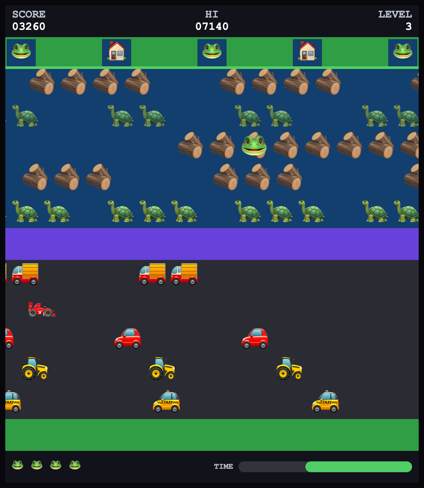

# 🐸 Frogger

A classic-style Frogger, built to be taken apart and rebuilt. Plain HTML, CSS
and JavaScript. No build step, no npm install, no framework. Open `index.html`
in a browser and it runs.

**▶ Play it: https://wstackable.github.io/frogger/**



## What's in it

The full arcade ruleset, not a half-finished demo:

- Five lanes of traffic and five lanes of river, laid out like the 1981 original
- Logs and turtles you ride, and turtles that dive and drown you
- Five home bays to fill, then the next level starts and everything speeds up
- Lives, a 30 second timer, arcade scoring, bonus lives, high score that sticks
- Keyboard (arrows or WASD), swipe, and on-screen buttons on phones
- Pause, restart, and a title screen
- Two complete art themes, and a way to drop in your own drawings

## Playing

| | |
|---|---|
| Move | Arrow keys, WASD, or swipe |
| Start / pause | Space, Enter, or tap |
| Restart | R |

Get a frog into each of the five bays at the top. Cars squash you, water drowns
you unless you are standing on something, and the turtles are not as loyal as
they look.

## The files

```
index.html          the page. loads the four scripts in order.
css/style.css       the page around the game (the game itself is a canvas)
js/config.js    ←   THIS IS THE ONE YOU EDIT
js/render.js        turns art settings into pixels
js/audio.js         the beeps, generated in code
js/game.js          the engine: rules, collisions, scoring, the game loop
assets/             put your own drawings here
tests/              optional. proves you did not break anything.
```

Almost everything you would want to change lives in **`js/config.js`**, and it
is heavily commented. The engine reads its values and hardcodes nothing, so you
can change how the game plays and how it looks without opening `game.js` at all.

## Customising it

See **[CUSTOMIZE.md](CUSTOMIZE.md)** for the guided version, written to be
followed by a kid sitting next to you. The five minute summary:

Change one character and you have a different game.

```js
// js/config.js
frog: { draw: 'emoji', glyph: '🐸' },      // now try 🐙 🦖 🐤 🚀
```

Flip the whole look with one line.

```js
theme: 'retro',    // the 1981 arcade look: rectangles and circles
theme: 'emoji',    // the friendly look
```

Make it easier or harder without touching any logic.

```js
lives: 5,                    // 99 if someone is having a bad day
timeLimit: 30,               // seconds per frog
speedRampPerLevel: 0.12,     // 0 = never gets harder
difficulty: {
  divingTurtles: false,      // turn off the mean ones
},
```

Redesign the board itself. Each row is one line.

```js
{ type: 'road', kind: 'car', length: 1, spacing: [3,3,7], speed: -0.75 },
//              ^ which art  ^ how long ^ gaps between   ^ how fast, and
//                                        them, repeating  which direction
```

Add your own artwork. Draw something, scan or export it as a PNG, drop it in
`assets/`, and point one line at it. See [assets/README.md](assets/README.md).

```js
frog: { draw: 'image', src: 'assets/my-frog.png' },
```

## Running it

Double-clicking `index.html` works, because the scripts are plain scripts rather
than ES modules. If you would rather serve it properly:

```bash
python3 -m http.server 8000     # then open http://localhost:8000
```

## Tests

Optional, but handy once you start changing the rules. They stub out a fake
browser and drive the real game code, so you can check that frogs still drown,
cars still squash, and levels still advance.

```bash
deno task test
```

Needs [Deno](https://deno.com). If you do not have it, skip this. Nothing else
in the project depends on it.

## Credit and licence

The lane and pattern system started from
[straker's Basic Frogger](https://gist.github.com/straker/82a4368849cbd441b05bd6a044f2b2d3),
released under CC0, which is a genuinely nice piece of code. Everything on top
of it (the art layer, lives, timer, scoring, levels, diving turtles, touch
support, sound, tests) was written for this project.

Frogger is a trademark of Konami. This is a hobby reimplementation for learning,
not affiliated with or endorsed by them.

Licensed under [CC0 1.0](LICENSE). Do whatever you like with it.
